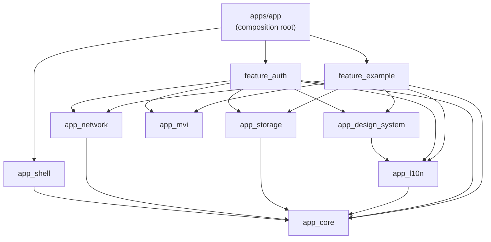

# 아키텍처

## 1. 전체 그림



**의존 방향은 항상 아래로만 흐른다.** 역방향(예: app_network → feature_auth)과
feature 간 직접 의존(feature_example → feature_auth)은 금지다.
연결이 필요하면 아래 3절의 의존성 역전 패턴을 사용한다.

## 2. 계층별 책임

| 계층 | 책임 | 금지 사항 |
|---|---|---|
| `apps/app` | 조립: 라우터, DI override, flavor 진입점, feature 간 연결 | 비즈니스 로직 |
| `app_shell` | 앱 공통 골격: 바인딩, 컨테이너, 전역 에러 훅, runApp (ADR-0007) | feature 지식, 라우팅 |
| `feature_*` | 하나의 기능 단위. domain / data / presentation 3계층 | 다른 feature import |
| `app_network` | Dio 구성, 인터셉터, DioException → NetworkException | 특정 feature 지식 |
| `app_storage` | KeyValue / Secure / JsonCache 저장소 | 특정 feature 지식 |
| `app_mvi` | MVI 계약과 유틸 (Intent/State/Effect) | 비즈니스 로직 |
| `app_l10n` | ARB 리소스, AppLocalizations, 예외→사용자 문구 매핑 | 비즈니스 로직 |
| `app_design_system` | 토큰, 테마, 공용 위젯 | 상태관리, 네트워크 |
| `app_core` | Result, 예외 체계, 로거, EnvConfig | **Flutter import 금지** (순수 Dart) |

### feature 내부 3계층

```text
feature_x/lib/src/
├── domain/          # 엔티티(freezed) + Repository 인터페이스. 외부 세계를 모른다.
│   └── usecases/    # (선택) 조합·공유·도메인 규칙이 생길 때만 추가 — ADR-0005
├── data/            # DTO + API + Repository 구현. domain 인터페이스를 구현한다.
├── presentation/    # 화면별 MVI 5파일. domain 인터페이스에만 의존한다.
└── di.dart          # 경계 provider(Repository/UseCase) 배선. presentation은 이것만 import
```

- **presentation → domain ← data** : presentation은 data를 직접 모른다.
  연결은 Riverpod provider(`xxxRepositoryProvider`)가 담당한다.
- **UseCase는 선택적 계층**이다. 기본은 ViewModel → Repository 직행이며,
  공유/조합/복잡한 도메인 규칙 조건이 생길 때만 추가한다.
  판단 기준과 예제(`GetPostDetailUseCase`)는 [ADR-0005](adr/0005-optional-usecase-layer.md) 참고.
- 외부에 공개할 것만 barrel(`lib/feature_x.dart`)에 export 한다.
  다른 패키지에서 `src/` 직접 import는 금지.

## 3. DI — Riverpod가 Hilt의 역할을 한다

DI 컨테이너는 별도로 없다. **provider 그래프가 곧 DI 그래프다.**

| Hilt (Android) | 이 템플릿 |
|---|---|
| `@Provides` 모듈 | `@Riverpod(keepAlive: true)` 함수 provider |
| `@Inject` 생성자 주입 | `ref.watch(xxxProvider)` |
| `@TestInstallIn` 테스트 교체 | `ProviderContainer(overrides: [...])` |
| 앱 모듈에서 바인딩 결정 | `bootstrap.dart`의 `overrides` |

### 의존성 역전 배선 (핵심 패턴)

app_network는 토큰이 필요하지만 feature_auth를 모른다(의존 방향 위반).
그래서 app_network가 **확장 지점 provider를 열어두고**, 앱이 배선한다:

```dart
// app_network — 기본값은 "토큰 없음"
@Riverpod(keepAlive: true)
TokenReader tokenReader(Ref ref) => () async => null;

// apps/app/bootstrap.dart — 실제 구현으로 override
tokenReaderProvider.overrideWith(
  (ref) => () => ref.read(authTokenStoreProvider).readAccessToken(),
),
```

`envConfigProvider`(app_core)도 같은 패턴이다 — 기본 구현은 throw 하고,
flavor 진입점이 bootstrap에서 반드시 주입한다.

## 4. MVI 프레젠테이션 (단방향 데이터 흐름)

```text
       ┌───────── Intent (사용자 의도) ─────────┐
       │                                        ▼
     View ◀──────── State (단일 불변) ──── ViewModel(Notifier)
       ▲                                        │
       └──── Effect (1회성: 스낵바/네비게이션) ──┘
```

화면당 5파일: `screen / view_model / state / intent / effect` (effect 없으면 생략).

**규칙**
1. View는 ViewModel의 유일한 진입점 `onIntent(...)`만 호출한다.
2. State는 freezed 단일 불변 객체. 로딩/에러도 필드로 표현한다.
3. 한 번만 소비되는 것(스낵바, 다이얼로그, 화면 이동)은 State가 아닌 Effect.
4. ViewModel은 `await` 뒤에 반드시 `if (!ref.mounted) return;` 가드.
5. ViewModel의 build()에서 `ref.onDispose(disposeEffects)` 등록 (Effect 사용 시).
6. State/Effect에는 사용자 문구(String) 대신 `AppException`을 담는다 —
   문구는 View가 `localizedMessage(context.l10n)`로 만든다 (l10n은 표현 관심사).

전역 상태(인증 세션 등)는 화면 MVI가 아니라 `keepAlive` Notifier로 관리한다
(`SessionController` 참고). 라우터 redirect가 이 상태를 구독하므로
**화면은 인증 분기 네비게이션을 하지 않는다** — 상태만 바꾸면 라우터가 반응한다.

## 5. 에러 처리 전략

```text
DioException ──(app_network exception_mapper)──▶ NetworkException ─┐
저장소 오류  ──(app_storage)─────────────────────▶ CacheException ──┼─▶ Result.failure
도메인 검증  ─────────────────────────────────────▶ ValidationException ┘
```

- Repository의 모든 public 메서드는 **throw 하지 않고 `Result<T>`를 반환**한다.
- ViewModel은 `switch (result) { case Success: ... case Failure: ... }`로
  처리하며, sealed 타입이라 누락이 컴파일 에러가 된다.
- `AppException.message`는 **개발자용(로그) 설명**이다. 사용자 노출 문구는
  View가 app_l10n의 `exception.localizedMessage(context.l10n)`로 만든다 —
  인프라는 실패의 분류(NetworkErrorType 등)까지만 책임진다.
- 잡히지 않은 에러는 bootstrap이 배선한 `ErrorReporter`(app_core)로 수렴한다.
  기본 구현은 로깅뿐이며, Sentry/Crashlytics 도입 시 `errorReporterProvider`만
  override 한다.

## 6. 오프라인 캐시 전략

`JsonCacheStore`(drift 기반 key-JSON 테이블)로 **네트워크 우선 + 캐시 폴백**:

1. 네트워크 성공 → 응답을 캐시에 저장하고 반환 (`fromCache: false`)
2. 네트워크 실패 → TTL 이내 캐시가 있으면 반환 (`fromCache: true`) → UI가 오프라인 배너 표시
3. 캐시도 없으면 실패 전파 → 전체 에러 화면 + 재시도

구현 예: `feature_example/src/data/posts_repository_impl.dart`

## 7. 앱 시작 시퀀스

```text
main_dev.dart ─▶ bootstrap(EnvConfig)            # 앱 고유 조립 (apps/app)
                   └─▶ bootstrapApp(...)          # 공통 골격 (app_shell)
                        ├─ ProviderContainer 생성 + overrides 배선
                        ├─ 전역 에러 훅 배선 (ErrorReporter)
                        ├─ afterInit: SessionController.restore() (기다리지 않음)
                        └─ runApp
라우터: AuthUnknown → 스플래시 → (복원 완료) → Authenticated? 홈 : 로그인
```

멀티 앱 확장(두 번째 앱 추가) 절차는 [manual/NEW_APP_GUIDE.md](manual/NEW_APP_GUIDE.md),
라우터를 앱별로 소유하는 근거는 [ADR-0007](adr/0007-per-app-router-shared-shell.md) 참고.
